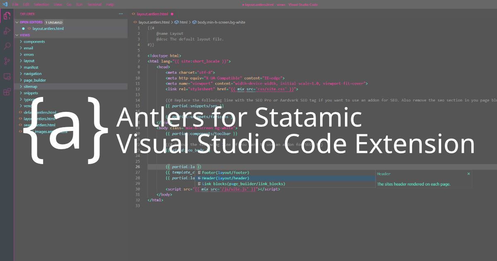

# An Antlers Extension for Visual Studio Code

This Visual Studio Code extension provides rich language support for the Antlers templating language, used for building Statamic websites.

This extension provides the following awesome capabilities:

* Basic syntax highlighting, *and* parser-driving semantic highlighting
* Modifier signature suggestions
* Intelligent suggestions based on your unique project's blueprints, collections, and more!
* An extensive add-on system
* Support for core Statamic 3 tags, modifiers, and more!

## Installation

To install the extension on your local machine, simply open Visual Studio Code and search for "Antlers Language for Statamic" in the Extensions panel. Once you find it, click "Install".

The extension will automatically activate the next time you open an Antlers HTML file.

Want to take your install even further? Consider checking out the documentation at [https://antlers.dev/](https://antlers.dev/).

## Change Log

Bugs fixed, what's new, and more! :)

### v1.1.3

* Improves the formatting behavior of `unless` conditionals ([#14](https://github.com/Stillat/vscode-antlers-language-server/issues/14))

### v1.1.2

* Adds support for the `all` and `self` locale tag parameters
* Improves default variable support for the `locale` tag

### v1.1.1

* Adds support for the `array` when using the `foreach` and `iterate` tags

### v1.1.0

* Adds a new `antlersOverrideHtmlComments` configuration option that can be used to always use Antlers comments in HTML documents
* Adds support for the `split` array modifier
* Adds support for the `format_translated` date modifier
* Adds support for the `add_slashes` string modifier
* Adds additional scope variables for the `nav` tag
* Adds support for `exists` and `if_exists` methods on the `partial` tag
* Improves completions for manifested array variables when using parameter-style modifiers

### v1.0.32

* Improves internal scope resolution

### v1.0.31

* Improves validation warnings with the `glide` tag

### v1.0.30

* Makes improvements to partial suggestions

### v1.0.29

* Background work to support an eventual Antlers Debugger

### v1.0.28

* Developers can now use VS Code's document links to navigate to detected partial files
* Developers can now see an overview/outline of their Antlers document within the Outline panel

### v1.0.24

* Removes `name` from the list of `statamic-tag-native-variable` to improve out-of-box syntax highlighting consistency [#11](https://github.com/Stillat/vscode-antlers-language-server/issues/11)

### v1.0.23

* The extension will no longer display warnings for unknown parameters (based on user feedback)
* Adds support for the field set prefixes when importing field-sets in auto-completion
* Adds support for the `installed` tag, with composer package autocompletions
* Automatically detects variable names within partials and adds them to the tag's parameter auto complete list.

## System PHP Configuration

If your development machine has PHP7+ installed and available in the `PATH` system variable, the extension will utilize a built-in PHP analyzer to help find details about your custom tags, view models, augmentation and Composer dependencies.

Having this enabled is not a requirement to use the extension's main features.

## License

This language extension is open-sourced software licensed under the [MIT license](https://opensource.org/licenses/MIT).
